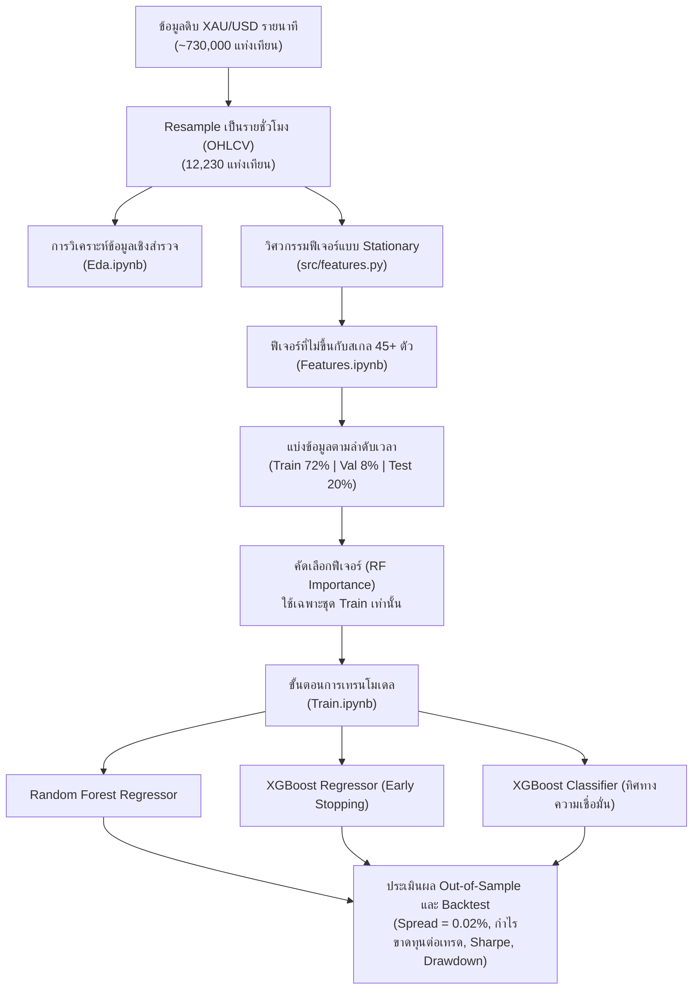

# 🌟 GoldMind: กรอบงาน Machine Learning และการพยากรณ์เชิงปริมาณสำหรับทองคำ (XAU/USD)

**GoldMind** คือกรอบงาน Machine Learning และ Quantitative Trading ระดับ production ที่ครบวงจร สำหรับการพยากรณ์ราคา **ทองคำ (XAU/USD)** แบบรายชั่วโมง (Hourly Forecasting)

โปรเจกต์นี้ถูกออกแบบมาเพื่อแก้ปัญหาที่ละเอียดอ่อนแต่สำคัญยิ่งในงาน Machine Learning ด้านการเงิน ได้แก่:
- **Non-stationarity** — ข้อมูลที่มีการเปลี่ยนแปลงคุณสมบัติทางสถิติไปตามเวลา
- **Lookahead Bias (Data Leakage)** — การรั่วไหลของข้อมูลอนาคตเข้าสู่กระบวนการเทรน
- **Asymmetric Positive Drift** — แนวโน้มขาขึ้นที่ไม่สมมาตรของสินทรัพย์
- **Transaction Cost Reality** — ต้นทุนการซื้อขายจริงที่มักถูกมองข้ามในงานวิจัย

---

## 📌 สถาปัตยกรรมและขั้นตอนการทำงาน (Architecture & Pipeline)



---

## 💡 หลักการเชิงระเบียบวิธีที่สำคัญ

### 1. ความไม่ขึ้นกับสเกล และ Stationarity (ทำไมราคาดิบถึงใช้ไม่ได้ผล)
โมเดลตระกูล Tree-based (Random Forest, XGBoost) แบ่งข้อมูลโดยใช้ค่าตัวเลขดิบเป็นเกณฑ์ (threshold) เมื่อนำไปใช้กับสินทรัพย์ที่มีแนวโน้ม (trending) อย่างทองคำ จะเกิดปัญหาดังนี้:

* หากใช้ระดับราคาดิบ (เช่น `ma_200`, `bb_upper`, `close_lag_1h`) ข้อมูลชุดทดสอบในช่วงตลาดกระทิงจะตกอยู่นอกช่วงของชุดข้อมูลฝึกฝนโดยสิ้นเชิง
* ต้นไม้ตัดสินใจจะจับคู่ข้อมูลทดสอบทั้งหมดไปยังโหนดปลาย (leaf node) สุดขั้วเพียงโหนดเดียว ส่งผลให้ประสิทธิภาพบนชุดทดสอบตกต่ำอย่างรุนแรง

**แนวทางแก้ไขของ GoldMind:** ฟีเจอร์ทั้ง 45+ ตัวถูกทำให้เป็นค่ามาตรฐาน (normalize) โดยอ้างอิงกับราคาปัจจุบันหรือถูกจำกัดขอบเขต (bounded) ดังนี้:
  - ระยะห่างสัมพัทธ์จากเส้นค่าเฉลี่ยเคลื่อนที่: $(Close / MA_w) - 1.0$
  - ATR แบบ Normalized: $ATR_{14} / Close$
  - Bollinger Bands: $\%B = \frac{Close - Lower}{Upper - Lower}$, $BandWidth = \frac{Upper - Lower}{MA}$
  - MACD แบบ Normalized: $\frac{EMA_{12} - EMA_{26}}{Close}$
  - การเข้ารหัสเวลาแบบวัฏจักร (Cyclical Time Encoding): $\sin/\cos(ชั่วโมง)$, $\sin/\cos(วันในสัปดาห์)$
  - Market Gap Flag: ตรวจจับการกระโดดของราคาช่วงเปิดตลาดหลังวันหยุดสุดสัปดาห์ / วันหยุดตลาด

### 2. ป้องกันการรั่วไหลของข้อมูล (Zero Data Leakage)
* ในไปป์ไลน์ทั่วไปที่ออกแบบไม่รัดกุม การคัดเลือกฟีเจอร์หรือการปรับสเกลข้อมูลมักถูกทำกับข้อมูลทั้งชุดก่อนแบ่งเทรน/เทสต์ ทำให้การกระจายตัวของข้อมูลในอนาคตรั่วไหลเข้าสู่ชุดฝึกฝน
* ใน GoldMind การแบ่งข้อมูลตามลำดับเวลา (Chronological Split) จะถูกทำ**ก่อนเป็นอันดับแรก** การจัดอันดับความสำคัญของฟีเจอร์และการคัดเลือกฟีเจอร์ที่สำคัญที่สุดจะ fit บน**ชุด Training เท่านั้น**อย่างเคร่งครัด

### 3. ต้นทุนการซื้อขายและตัวชี้วัดการดำเนินการที่สมจริง
* ทุกการเทรดมีต้นทุน Spread **0.02% (2 basis points หรือประมาณ 0.50 ดอลลาร์/ออนซ์)** ซึ่งสะท้อนสเปรดของโบรกเกอร์และค่าคอมมิชชันตามความเป็นจริง
* รายงานผลลัพธ์แยกความแตกต่างระหว่าง **Hourly Bar Win Rate** (% ของชั่วโมงที่ให้ผลตอบแทนเป็นบวก) และ **Trade Win Rate** (% ของการเทรดแบบ round-trip ตั้งแต่เข้าจนออกที่มีกำไรสุทธิเป็นบวก) พร้อมด้วย **Profit Factor** และ **Annualized Sharpe Ratio** ($\times \sqrt{6000}$)

---

## 📂 โครงสร้างโปรเจกต์

```
GoldMind/
├── data/
│   └── XAU_1m_data.csv             # ข้อมูลราคาทองคำย้อนหลังรายนาที
├── eda_output/                     # กราฟและสถิติรายปีจากการวิเคราะห์ข้อมูล
│   ├── price_volume_trend.png
│   ├── return_distribution.png
│   ├── hourly_volatility.png
│   ├── autocorrelation_clustering.png
│   └── yearly_summary.csv
├── model_output/                   # ผลลัพธ์โมเดลและการ backtest
│   ├── metrics_comparison.csv
│   ├── backtest_summary.csv
│   ├── feature_importances.csv
│   ├── selected_features.csv
│   ├── test_predictions.csv
│   ├── feature_importances_demo.png
│   └── strategy_equity_curve.png
├── src/
│   ├── __init__.py
│   └── features.py                 # โมดูลหลักสำหรับวิศวกรรมและคัดเลือกฟีเจอร์
├── Eda.ipynb                       # การวิเคราะห์ข้อมูลเชิงสำรวจและ ARCH clustering
├── Features.ipynb                  # การสร้างฟีเจอร์และตรวจสอบ stationarity
├── Train.ipynb                     # ไปป์ไลน์การเทรน, ประเมินผล และ backtest เชิงปริมาณ
├── build_all_notebooks.py          # สคริปต์สร้างไฟล์ Jupyter Notebook ทั้งหมด
├── requirements.txt                # รายการไลบรารีที่จำเป็นทั้งหมด
└── README.md                       # เอกสารประกอบโปรเจกต์
```

---

## 📊 สรุปผลลัพธ์ Out-of-Sample (ชุดทดสอบ)

| ตัวชี้วัด | Random Forest | XGBoost Regressor | XGBoost Classifier (Conviction) | Buy & Hold (เกณฑ์เทียบ) |
| :--- | :---: | :---: | :---: | :---: |
| **ความแม่นยำเชิงทิศทาง** | 52.54% | **54.09%** | **54.28%** | N/A |
| **MAE** | 0.002475 | **0.002455** | N/A | N/A |
| **RMSE** | 0.004958 | **0.004939** | N/A | N/A |
| **R² Score** | -0.00760 | **+0.00032** | N/A | N/A |
| **ผลตอบแทนสุทธิรวม** | 45.62% | **118.74%** | 6.57% | 52.27% |
| **Annualized Sharpe** | 2.64 | **5.32** | 0.63 | 2.93 |
| **Max Drawdown** | 13.83% | **8.62%** | 12.87% | 18.91% |
| **Trade Win Rate** | 55.30% | 54.51% | **58.79%** | N/A |
| **Profit Factor** | 1.52 | **2.24** | 1.19 | N/A |

> 📝 **หมายเหตุ:** ตัวเลขทั้งหมดคำนวณจากชุดข้อมูลทดสอบ (Test Set) ที่แบ่งแยกตามลำดับเวลาอย่างเคร่งครัด (ไม่มีการ shuffle) เพื่อจำลองสภาวะการเทรดจริงให้ใกล้เคียงที่สุด

---

## 📓 รายละเอียดของแต่ละ Notebook

โปรเจกต์นี้แบ่งขั้นตอนการทำงานออกเป็น 3 Notebook หลัก โดยแต่ละไฟล์รับผิดชอบหน้าที่ที่ชัดเจนแยกจากกัน เพื่อให้ไปป์ไลน์ทั้งหมดตรวจสอบและทำซ้ำ (reproducible) ได้ง่าย

### 1️⃣ `Eda.ipynb` — การวิเคราะห์ข้อมูลเชิงสำรวจ (Exploratory Data Analysis)

Notebook นี้ทำหน้าที่ตรวจสอบคุณภาพของข้อมูลดิบ และทำความเข้าใจพฤติกรรมของราคาทองคำก่อนเริ่มสร้างฟีเจอร์ใด ๆ ประกอบด้วยขั้นตอนดังนี้:

1. **โหลดข้อมูลและ Resample** — อ่านข้อมูลราคาทองคำรายนาที (1-minute OHLCV) แล้วแปลง (resample) เป็นแท่งเทียนรายชั่วโมงด้วยกฎ `Open=first, High=max, Low=min, Close=last, Volume=sum`
2. **ตรวจสอบคุณภาพและความสมบูรณ์ของข้อมูล (Data Quality Checks)** — ตรวจหาค่าที่หายไป (missing values), timestamp ที่ซ้ำกัน, ความผิดปกติของ OHLC (เช่น High ต่ำกว่า Low), ราคาที่ไม่เป็นบวก, แท่งเทียนที่ Volume เป็นศูนย์ และช่องว่างของเวลา (gap) ที่เกิน 6 ชั่วโมงซึ่งมักเกิดจากวันหยุดสุดสัปดาห์หรือวันหยุดตลาด
3. **กราฟแนวโน้มราคาและปริมาณการซื้อขาย** — พล็อตราคาปิดรายชั่วโมงคู่กับปริมาณการซื้อขาย เพื่อดูภาพรวมของแนวโน้มตลาดตลอดช่วงเวลาที่มีข้อมูล
4. **การกระจายตัวของผลตอบแทน (Return Distribution)** — คำนวณค่าเฉลี่ย ส่วนเบี่ยงเบนมาตรฐาน ความเบ้ (skewness) ความโด่ง (excess kurtosis) และ Value at Risk (VaR 95%) ของผลตอบแทนรายชั่วโมง พร้อมเปรียบเทียบกับการกระจายแบบปกติ (Normal Distribution) เพื่อยืนยันลักษณะ **fat tails** ที่พบได้ทั่วไปในข้อมูลการเงิน
5. **รูปแบบความผันผวนตามช่วงเวลา (Session Volatility)** — วิเคราะห์ความผันผวนเฉลี่ยแยกตามชั่วโมง (UTC) พร้อมไฮไลต์ช่วงตลาดลอนดอน (07–16 UTC) และตลาดนิวยอร์ก (12–20 UTC) เพื่อดูว่าความผันผวนสูงสุดเกิดขึ้นในช่วงใดของวัน
6. **Autocorrelation และ Volatility Clustering (ARCH Effect)** — คำนวณค่า Autocorrelation Function (ACF) ทั้งของผลตอบแทนดิบ (เพื่อตรวจสอบสมมติฐาน Random Walk) และของผลตอบแทนสัมบูรณ์ (เพื่อตรวจจับปรากฏการณ์ volatility clustering แบบ ARCH ซึ่งเป็นคุณสมบัติสำคัญของสินทรัพย์ทางการเงิน)
7. **ตารางสรุปผลรายปี (Yearly Summary)** — สรุปราคาเปิด/ปิด/สูงสุด/ต่ำสุด จำนวนแท่งเทียน ปริมาณการซื้อขายเฉลี่ย และผลตอบแทนรายปีของทองคำ แล้วบันทึกเป็นไฟล์ `yearly_summary.csv`

📁 **ผลลัพธ์ที่ได้:** กราฟทั้งหมดถูกบันทึกไว้ในโฟลเดอร์ `eda_output/` ได้แก่ `price_volume_trend.png`, `return_distribution.png`, `hourly_volatility.png`, `autocorrelation_clustering.png` และ `yearly_summary.csv`

---

### 2️⃣ `Features.ipynb` — วิศวกรรมฟีเจอร์แบบ Stationary

Notebook นี้สาธิตวิธีการสร้างฟีเจอร์ทางเทคนิคกว่า 45+ ตัวที่ **ไม่ขึ้นกับสเกลราคา (scale-invariant)** โดยเรียกใช้โมดูล `src/features.py` เป็นแกนหลัก:

1. **โหลดและ Resample ข้อมูล** เช่นเดียวกับใน `Eda.ipynb`
2. **สร้างฟีเจอร์ผ่านฟังก์ชัน `build_features()`** ซึ่งสร้างฟีเจอร์ทั้งหมด 52 ตัวจาก 12,230 แท่งเทียน แบ่งเป็นกลุ่มดังนี้:
   - **ผลตอบแทนหลายช่วงเวลา (Multi-horizon Returns):** `ret_1` ถึง `ret_34`, `ret_240`
   - **ผลตอบแทนย้อนหลังแบบ Autoregressive (Lag Features):** `ret_lag_1h` ถึง `ret_lag_10h`
   - **ระยะห่างสัมพัทธ์จากเส้นค่าเฉลี่ยเคลื่อนที่:** `px_over_ma_5` ถึง `px_over_ma_200`
   - **ความผันผวนและ ATR แบบ Normalized:** `vol_5` ถึง `vol_50`, `atr_pct_14`, `atr_pct_50`
   - **Bollinger Bands แบบ Normalized:** `bb_pct_b`, `bb_width`
   - **Wilder's RSI:** `rsi_7`, `rsi_14`, `rsi_21`
   - **MACD แบบ Normalized:** `macd_norm`, `macd_signal_norm`, `macd_hist_norm`
   - **Volume Z-score และอัตราส่วนปริมาณการซื้อขาย:** `vol_zscore_20`, `vol_ratio_ma_5` ฯลฯ
   - **รูปทรงแท่งเทียน (Candle Geometry):** `candle_body`, `candle_upper_wick`, `candle_lower_wick`
   - **การเข้ารหัสเวลาแบบวัฏจักรและ Session:** `hour_sin`, `hour_cos`, `dow_sin`, `dow_cos`, `is_market_gap`
3. **ตรวจสอบ Stationarity** — ยืนยันว่าไม่มีคอลัมน์ราคาดิบ (เช่น `Close`, `ma_20`, `bb_upper`) หลงเหลืออยู่ในชุดฟีเจอร์ พร้อมแสดงสถิติสรุป (`describe()`) ของฟีเจอร์ตัวอย่างเพื่อยืนยันว่าค่าทั้งหมดอยู่ในช่วงที่มีขอบเขตแน่นอน (bounded)
4. **สาธิตการคัดเลือกฟีเจอร์ (Feature Selection Demo)** — ใช้ `select_top_features()` โดย fit บนชุด Train เพียง 72% แรก (8,632 ตัวอย่าง) เท่านั้น เพื่อป้องกัน data leakage อย่างเคร่งครัด แล้วจัดอันดับ 15 ฟีเจอร์ที่สำคัญที่สุด เช่น `px_over_ma_20`, `candle_upper_wick`, `candle_lower_wick`, `px_over_ma_50`, `hl_range` เป็นต้น
5. **แสดงกราฟ Feature Importance** — พล็อตกราฟแท่งแนวนอนของ 15 ฟีเจอร์ที่สำคัญที่สุดจาก Random Forest แล้วบันทึกเป็น `feature_importances_demo.png`

---

### 3️⃣ `Train.ipynb` — การเทรนโมเดล ประเมินผล และ Backtest กลยุทธ์

Notebook หลักที่รวมทุกขั้นตอนของไปป์ไลน์เข้าด้วยกัน ตั้งแต่การเตรียมข้อมูลจนถึงการจำลองกลยุทธ์การเทรดจริง:

1. **ตั้งค่าพารามิเตอร์หลัก (Configuration)** — กำหนดค่าคงที่ที่สำคัญ เช่น จำนวนฟีเจอร์ที่คัดเลือก (`N_FEATURES_SELECTED = 20`), ขอบเขตเวลาพยากรณ์ (`TARGET_HORIZON = 1`), สัดส่วนชุดทดสอบ (`TEST_SIZE = 20%`), สัดส่วนชุด Validation (`VAL_SIZE = 10%` ของส่วน Train) และต้นทุน Spread (`SPREAD_PCT = 0.02%`)
2. **โหลดข้อมูล สร้างฟีเจอร์ และสร้างตัวแปรเป้าหมาย** — เรียกใช้ `build_features()` และ `make_target()` เพื่อสร้างทั้งเป้าหมายแบบ Regression (ขนาดของผลตอบแทน) และแบบ Classification (ทิศทางขึ้น/ลง)
3. **แบ่งข้อมูลตามลำดับเวลาก่อนเสมอ (Chronological Split First)** — แบ่งเป็น Train / Validation / Test ตามลำดับเวลาอย่างเคร่งครัด (ไม่มีการสุ่มหรือ shuffle) เพื่อจำลองสภาพแวดล้อมการเทรดจริงที่ไม่สามารถมองเห็นอนาคตได้
4. **คัดเลือกฟีเจอร์บนชุด Train เท่านั้น** — เรียก `select_top_features()` โดยใช้ข้อมูลเฉพาะช่วง Train เพื่อคัดเลือก 20 ฟีเจอร์ที่มีนัยสำคัญที่สุด ก่อนนำไปกรองใช้กับชุด Validation และ Test
5. **เทรนโมเดลทั้งสามตัว:**
   - **Random Forest Regressor** (250 ต้นไม้, ความลึกสูงสุด 10)
   - **XGBoost Regressor** พร้อม Early Stopping (สูงสุด 500 รอบ, หยุดหากไม่พัฒนาใน 40 รอบ)
   - **XGBoost Classifier** สำหรับพยากรณ์ความน่าจะเป็นเชิงทิศทาง พร้อม Early Stopping เช่นกัน
6. **ประเมินผลบนชุดทดสอบ (Out-of-Sample Evaluation)** — คำนวณ MAE, RMSE, R², Directional Accuracy สำหรับโมเดล Regression และ Accuracy กับ ROC-AUC สำหรับโมเดล Classifier
7. **จำลองกลยุทธ์การเทรดและ Backtest (`run_backtest()`)** — แปลงค่าพยากรณ์เป็นสัญญาณซื้อ/ขาย (Long/Short) โดยหักต้นทุน Spread ทุกครั้งที่เปลี่ยนสถานะ แล้วคำนวณ:
   - **Equity Curve** และ **Total Return**
   - **Annualized Sharpe Ratio** (ปรับด้วย $\sqrt{6000}$ ชั่วโมงการเทรดต่อปี)
   - **Max Drawdown**
   - **Hourly Win Rate** เทียบกับ **Trade Win Rate** (คำนวณจากรอบการเทรดจริงตั้งแต่เข้าจนออก)
   - **Profit Factor** (อัตราส่วนกำไรรวมต่อขาดทุนรวม)
   - เปรียบเทียบกับกลยุทธ์ **Buy & Hold** เป็นเกณฑ์อ้างอิง
8. **ส่งออกผลลัพธ์และโมเดลที่เทรนแล้ว (Export Artifacts)** — บันทึกไฟล์ทั้งหมดลงในโฟลเดอร์ `model_output/` ได้แก่ `metrics_comparison.csv`, `backtest_summary.csv`, `feature_importances.csv`, `selected_features.csv`, `test_predictions.csv` รวมถึงบันทึกโมเดลที่เทรนแล้วเป็นไฟล์ `rf_model.joblib`, `xgb_regressor.json`, `xgb_classifier.json` เพื่อให้สามารถนำไปใช้ต่อ (inference) ได้โดยไม่ต้องเทรนใหม่

---

## 🚀 วิธีการใช้งาน

### 1. ข้อกำหนดเบื้องต้น (Prerequisites)
ตรวจสอบให้แน่ใจว่าติดตั้ง Python 3.10 ขึ้นไป พร้อมไลบรารีที่จำเป็น:
```bash
pip install pandas numpy scikit-learn xgboost matplotlib jupyter
```

หรือติดตั้งจากไฟล์ `requirements.txt` โดยตรง:
```bash
pip install -r requirements.txt
```

### 2. การรันผ่าน Jupyter / VS Code
เปิดและรันโน้ตบุ๊กตามลำดับดังนี้:
1. **`Eda.ipynb`** — รันทุกเซลล์เพื่อดูการกระจายตัวของข้อมูล ความผันผวนตามช่วงเวลาตลาด และการรวมกลุ่มความผันผวนแบบ ARCH
2. **`Features.ipynb`** — สร้างและตรวจสอบความถูกต้องของตัวชี้วัดทางเทคนิคแบบ stationary ทั้งหมด
3. **`Train.ipynb`** — เทรนโมเดล ตรวจสอบตัวชี้วัด out-of-sample และดูกราฟ equity curve จากการ backtest

### 3. การสร้างโน้ตบุ๊กใหม่ทั้งหมด
หากต้องการสร้างโน้ตบุ๊กทั้งสามไฟล์ใหม่จากซอร์สโค้ดโดยอัตโนมัติ:
```bash
python build_all_notebooks.py
```

---

## 🧭 แนวทางการพัฒนาต่อ (Roadmap)

- [ ] เพิ่มโมเดลตระกูล Deep Learning (LSTM / Temporal Fusion Transformer) เพื่อเปรียบเทียบกับโมเดล tree-based
- [ ] รองรับการเทรนและอนุมานผลแบบ walk-forward (Rolling Window Retraining)
- [ ] เพิ่มระบบ Hyperparameter Optimization อัตโนมัติ (Optuna)
- [ ] จัดทำ Dashboard แบบ interactive สำหรับติดตามผล backtest แบบเรียลไทม์
- [ ] ขยายไปยังคู่สินทรัพย์อื่น (เช่น Silver, Oil) เพื่อทดสอบความสามารถในการนำไปใช้ทั่วไปของฟีเจอร์

---

## ⚠️ ข้อจำกัดความรับผิดชอบ (Disclaimer)

โปรเจกต์นี้จัดทำขึ้นเพื่อ**วัตถุประสงค์ด้านการศึกษาและการวิจัยเท่านั้น** ผลลัพธ์ที่แสดงในรายงาน (backtest) เป็นผลลัพธ์ในอดีต (historical) และ**ไม่ได้เป็นการรับประกันผลตอบแทนในอนาคต** การซื้อขายทองคำและตราสารทางการเงินอื่น ๆ มีความเสี่ยงสูงและอาจทำให้สูญเสียเงินลงทุนทั้งหมด ผู้ใช้งานควรศึกษาข้อมูลเพิ่มเติมและปรึกษาผู้เชี่ยวชาญทางการเงินก่อนตัดสินใจลงทุนจริง
