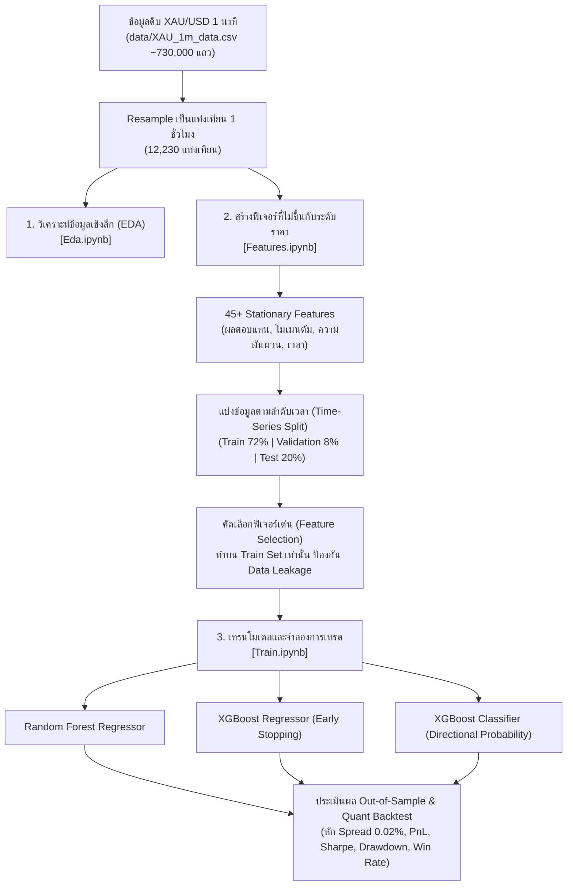

# 🌟 GoldMind: ระบบพยากรณ์และกลยุทธ์การเทรดทองคำ (XAU/USD) ด้วย Machine Learning

ระบบ Machine Learning และ Quantitative Trading สำหรับการวิเคราะห์และทำนายทิศทางราคาทองคำ (**XAU/USD**) ในระดับแท่งเทียน 1 ชั่วโมง (Hourly Timeframe) อย่างครบวงจร

โปรเจกต์นี้ถูกออกแบบมาเพื่อแก้ปัญหาสำคัญของการประยุกต์ใช้ Machine Learning กับข้อมูลอนุกรมเวลาทางการเงิน ได้แก่ **Non-Stationarity (ความไม่คงที่ของระดับราคา)**, **Lookahead Bias / Data Leakage (การรั่วไหลของข้อมูลอนาคต)**, และ **Transaction Costs (ต้นทุนค่าธรรมเนียมและ Spread ในตลาดจริง)**

---

## 📌 ขั้นตอนการทำงานของระบบ (Pipeline Architecture)

กระบวนการทั้งหมดถูกจัดแบ่งออกเป็นขั้นตอนอย่างเป็นระบบผ่าน Jupyter Notebooks (`.ipynb`):



---

## 💡 หลักการสำคัญด้านสถิติและการเงิน (Methodology)

### 1. ความคงที่และไม่ยึดติดกับระดับราคา (Stationarity & Scale-Invariance)
โมเดลกลุ่ม Decision Tree (Random Forest, XGBoost) จะทำการแบ่ง Split โหนดตามเกณฑ์ตัวเลขตายตัว (Raw Numeric Thresholds):
* **ปัญหาของราคาดิบ:** หากนำราคาดั้งเดิมหรือเส้นค่าเฉลี่ยดิบ (เช่น `ma_200`, `bb_upper`, `close_lag_1h`) มาเป็นฟีเจอร์ เมื่อราคาทองคำปรับตัวขึ้นทำ All-Time High ในช่วงทดสอบ ข้อมูล Test Set ทั้งหมดจะหลุดออกนอกช่วงที่โมเดลเคยเรียนรู้ใน Train Set ส่งผลให้โมเดลทำนายผิดพลาดอย่างรุนแรง
* **การแก้ไขใน [Features.ipynb](file:///c:/Users/pboon/OneDrive/Desktop/pid/GoldMind/Features.ipynb):** ตัวชี้วัดทั้งหมด 45+ ตัว ถูกแปลงให้อยู่ในรูปอัตราส่วนสัมพัทธ์ (Relative / Normalized) หรือมีขอบเขตจำกัด:
  - ระยะห่างเทียบกับเส้นค่าเฉลี่ย: $\frac{Close}{MA_w} - 1.0$
  - ATR ปรับตามระดับราคา: $\frac{ATR_{14}}{Close}$
  - Bollinger Bands: $\%B = \frac{Close - Lower}{Upper - Lower}$ และ $BandWidth = \frac{Upper - Lower}{MA}$
  - MACD Normalized: $\frac{EMA_{12} - EMA_{26}}{Close}$
  - Cyclical Time Encoding: $\sin/\cos(Hour)$, $\sin/\cos(DayOfWeek)$
  - สัญญาณช่องว่างตลาด (Market Gap Flag): ตรวจจับแท่งเปิดตลาดเช้าวันจันทร์หลังหยุดสุดสัปดาห์

### 2. ป้องกันข้อมูลอนาคตรั่วไหลโดยสมบูรณ์ (Zero Data Leakage)
* ใน [Features.ipynb](file:///c:/Users/pboon/OneDrive/Desktop/pid/GoldMind/Features.ipynb) และ [Train.ipynb](file:///c:/Users/pboon/OneDrive/Desktop/pid/GoldMind/Train.ipynb) จะทำการตัดแบ่งข้อมูลตามลำดับเวลา (Chronological Split) ก่อนเสมอ
* การคัดเลือก Top Features ด้วย Random Forest Importance จะคำนวณบนชุด **Training Partition เท่านั้น** ไม่มีการใช้ข้อมูล Validation หรือ Test มาร่วมคำนวณ เพื่อให้ผลลัพธ์เป็น Out-of-Sample ที่แท้จริง

### 3. จำลองต้นทุนการเทรดเสมือนจริง (Realistic Execution & Backtest)
* มีการหักค่า Transaction Cost / Spread ทุกครั้งที่มีการเปลี่ยนสถานะสัญญา **0.02% (2 basis points หรือ ~$0.50 ต่อออนซ์ทองคำ)** ซึ่งตรงกับสภาพคล่องจริงของโบรเกอร์ชั้นนำ
* แยกการรายงานผลกำไร-ขาดทุนระหว่าง:
  - **Hourly Win Rate (%):** อัตราส่วนชั่วโมงที่ราคาวิ่งถูกทาง
  - **Trade Win Rate (%):** อัตราส่วนไม้เทรดรอบไป-กลับ (Round-trip trade ตั้งแต่เปิดจนปิดสัญญา) ที่ปิดด้วยกำไรสุทธิ
  - **Profit Factor:** อัตราส่วนกำไรรวมเทียบกับผลขาดทุนรวม ($\frac{\sum \text{Gains}}{\sum |\text{Losses}|}$)
  - **Annualized Sharpe Ratio:** ปรับตามชั่วโมงเทรดรายปี ($\times \sqrt{6000}$)

---

## 📂 โครงสร้างโฟลเดอร์และไฟล์ในโปรเจกต์

```
GoldMind/
├── data/
│   └── XAU_1m_data.csv             # ข้อมูลดิบราคาทองคำ XAU/USD ระดับ 1 นาที
├── eda_output/                     # ภาพกราฟและสถิติจากการวิเคราะห์ข้อมูล (EDA)
│   ├── price_volume_trend.png
│   ├── return_distribution.png
│   ├── hourly_volatility.png
│   ├── autocorrelation_clustering.png
│   └── yearly_summary.csv
├── model_output/                   # ผลลัพธ์จากการเทรนและกราฟผลตอบแทน (Backtest)
│   ├── metrics_comparison.csv
│   ├── backtest_summary.csv
│   ├── feature_importances.csv
│   ├── selected_features.csv
│   ├── test_predictions.csv
│   ├── feature_importances_demo.png
│   └── strategy_equity_curve.png
├── Eda.ipynb                       # 1. โน้ตบุ๊กสำรวจข้อมูล ตรวจสอบคุณภาพ และความผันผวน
├── Features.ipynb                  # 2. โน้ตบุ๊กสร้างฟีเจอร์ Stationary และทดสอบ Feature Selection
├── Train.ipynb                     # 3. โน้ตบุ๊กเทรนโมเดล ประเมินผล และจำลองกลยุทธ์การเทรด
└── README.md                       # คู่มืออธิบายระบบและผลการทดสอบ
```

---

## 📊 สรุปผลการทดสอบบนชุดข้อมูลทดสอบ (Out-of-Sample Test Set)

เปรียบเทียบผลลัพธ์ของโมเดลบนชุดข้อมูลทดสอบ 20% หลังสุดของช่วงเวลา (หักค่าธรรมเนียมและ Spread 0.02% ทุกไม้):

| ตัวชี้วัด | Random Forest | XGBoost Regressor | XGBoost Classifier (Conviction) | เกณฑ์มาตรฐาน Buy & Hold |
| :--- | :---: | :---: | :---: | :---: |
| **Directional Accuracy** | 52.54% | **54.09%** | **54.28%** | N/A |
| **MAE** | 0.002475 | **0.002455** | N/A | N/A |
| **RMSE** | 0.004958 | **0.004939** | N/A | N/A |
| **$R^2$ Score** | -0.00760 | **+0.00032** | N/A | N/A |
| **Total Net Return (%)** | 45.62% | **118.74%** | 6.57% | 52.27% |
| **Annualized Sharpe Ratio**| 2.64 | **5.32** | 0.63 | 2.93 |
| **Max Drawdown (%)** | 13.83% | **8.62%** | 12.87% | 18.91% |
| **Trade Win Rate (%)** | 55.30% | 54.51% | **58.79%** | N/A |
| **Profit Factor** | 1.52 | **2.24** | 1.19 | N/A |
| **จำนวนไม้เทรดรวม** | 443 ไม้ | 255 ไม้ | 979 ไม้ | 1 ไม้ |

---

## 🚀 ขั้นตอนการเปิดใช้งาน (How to Run)

### 1. ติดตั้งไลบรารีที่จำเป็น
```bash
pip install pandas numpy scikit-learn xgboost matplotlib jupyter
```

### 2. ลำดับการเปิดใช้งานโน้ตบุ๊ก (`.ipynb`)
เปิดและรันเซลล์ตามลำดับเพื่อความต่อเนื่องของกระบวนการ:
1. **[Eda.ipynb](file:///c:/Users/pboon/OneDrive/Desktop/pid/GoldMind/Eda.ipynb):**
   * ตรวจสอบความถูกต้องของข้อมูล OHLCV, เช็คแท่งเทียนที่ผิดปกติ, ดูแนวโน้มราคาและปริมาณการซื้อขาย
   * วิเคราะห์รูปแบบความผันผวนตามช่วงเวลาเปิดตลาด (London & New York Sessions)
   * ตรวจสอบ Autocorrelation (ACF) และความผันผวนแบบเกาะกลุ่ม (ARCH Effect)
2. **[Features.ipynb](file:///c:/Users/pboon/OneDrive/Desktop/pid/GoldMind/Features.ipynb):**
   * สร้างฟีเจอร์ทางเทคนิคที่ไม่ยึดติดกับระดับราคาทั้ง 45+ ตัว
   * ตรวจสอบยืนยันว่าไม่มีระดับราคาดิบหลุดเข้ามา
   * ทดสอบขั้นตอนการคัดเลือกฟีเจอร์เฉพาะบน Train Partition
3. **[Train.ipynb](file:///c:/Users/pboon/OneDrive/Desktop/pid/GoldMind/Train.ipynb):**
   * แบ่งข้อมูล Train / Validation / Test ตามลำดับเวลา
   * เทรนโมเดล Random Forest และ XGBoost
   * รันระบบจำลองการเทรด (Backtest) พร้อมหักค่า Spread
   * พล็อตเส้นกราฟผลตอบแทนสะสม (Equity Curve) และส่งออกรายงานสถิติไปยังโฟลเดอร์ `model_output/`