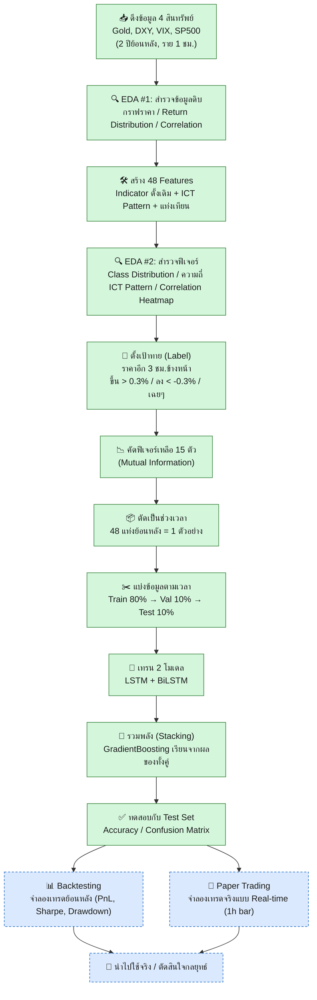

## 🧬 Alternative Track: Deep Learning Directional Classifier (LSTM + BiLSTM + ICT Patterns)

> แนวทางเสริมของ GoldMind — แทนที่จะ**ทำนายราคา** (Regression) แบบไปป์ไลน์หลัก
> โมดูลนี้**ทำนายทิศทาง** (Classification: Down / Neutral / Up) โดยผสาน Technical Indicator เข้ากับ ICT Price Action
> พร้อมขั้นตอน **EDA (สำรวจข้อมูล)** ที่เพิ่มเข้ามาใหม่ ก่อนเข้าสู่การสร้างฟีเจอร์และเทรนโมเดล

### ภาพรวมทั้งหมดใน 1 รูป

> 🟢 = ทำเสร็จแล้วในโน้ตบุ๊กปัจจุบัน &nbsp;&nbsp; 🔵 = แผนต่อยอด (ยังไม่ได้ทำ)




**สรุปสั้น:** ตอนนี้ไปป์ไลน์ทำถึงขั้น "ทดสอบกับ Test Set" แล้ว (accuracy 48.49%) และมีขั้นตอน **EDA ครบ 2 จุด** แล้ว (สำรวจข้อมูลดิบ + สำรวจฟีเจอร์) แต่ **ยังไม่ได้เอาไปทดลองเทรดจริง** — ขั้นถัดไปคือ Backtesting และ Paper Trading

---

### พูดง่าย ๆ คือ...

โมเดลนี้พยายามตอบคำถามว่า **"3 ชั่วโมงข้างหน้า ราคาทองจะขึ้น จะลง หรือเฉย ๆ?"**
ก่อนสร้างโมเดลจะ**สำรวจข้อมูลก่อน (EDA)** เพื่อดูว่าข้อมูลสะอาดแค่ไหน มีรูปแบบอะไรซ้ำบ่อย และฟีเจอร์ไหนซ้ำซ้อนกันเอง จากนั้นค่อยดูทั้ง (1) ตัวเลขทางเทคนิคทั่วไป เช่น RSI, MACD และ (2) "ร่องรอย" ที่นักเทรดสาย ICT ใช้ดูด้วยตาเปล่า เช่น ช่องว่างราคา (FVG) หรือจุดกลับตัวของโครงสร้างราคา (BOS/CHoCH) — แล้วเอาทั้งหมดมาป้อนให้โมเดล Deep Learning 2 ตัวช่วยกันทาย ก่อนให้โมเดลตัวที่ 3 (Gradient Boosting) มาตัดสินคำตอบสุดท้าย

---

### 1️⃣ ข้อมูล (Data) — เอาอะไรมาใช้บ้าง

| แหล่งข้อมูล | Ticker | ใช้ทำอะไร |
|---|---|---|
| ทองคำ (Gold) | `GC=F` | ตัวหลักที่จะทำนาย (Open/High/Low/Close/Volume) |
| ดัชนีดอลลาร์ (DXY) | `DX-Y.NYB` | ทองมักสวนทางดอลลาร์ |
| ดัชนีความกลัวตลาด (VIX) | `^VIX` | วัดความผันผวน/ความกลัวในตลาด |
| ดัชนีหุ้นสหรัฐ (S&P500) | `^GSPC` | ดูบรรยากาศตลาดหุ้นโดยรวม |

- ดึงย้อนหลัง **2 ปี** ที่ความละเอียด **รายชั่วโมง** → ได้ข้อมูลดิบ **10,398 แถว** (ตัวเลขขยับได้เล็กน้อยทุกครั้งที่รันใหม่ เพราะเป็นหน้าต่างข้อมูล 2 ปีแบบ rolling)
- **ไม่มี missing values เลย** หลังจากทำ `ffill()` (เช็คแล้วในขั้น EDA)
- Volume ของทองเป็น 0 อยู่ **3.53%** ของแท่งทั้งหมด (ต้องระวังตอนคำนวณ % การเปลี่ยนแปลง ไม่งั้นจะเกิดค่า inf)

---

### 2️⃣ EDA — สำรวจข้อมูลก่อนสร้างโมเดล (ส่วนที่เพิ่มเข้ามาใหม่)

#### 🔍 EDA #1: ข้อมูลดิบ

| ตัวชี้วัด | ค่าที่พบ |
|---|---|
| ช่วงราคาทอง (Gold Close) | ต่ำสุด **2,599.60** → สูงสุด **5,591.00** USD (วิ่งขึ้นเกือบเท่าตัวใน 2 ปี) |
| ราคาเฉลี่ย / ส่วนเบี่ยงเบน | 3,872 ± 732 USD (ความผันผวนสูง สอดคล้องกับที่ราคาวิ่งเป็นเทรนด์แรง) |
| Return รายชั่วโมง (Gold) | เฉลี่ย +0.005% / ส่วนเบี่ยงเบน 0.32% |
| Return ต่ำสุด/สูงสุด (Gold) | **-7.66%** ถึง **+2.91%** ในชั่วโมงเดียว → มี "หางหนัก" (fat tail) เกิดเหตุการณ์ผันผวนรุนแรงเป็นครั้งคราว |
| Correlation Gold ↔ อื่น ๆ | ดูจาก heatmap — สอดคล้องทฤษฎีว่า Gold มักสวนทาง DXY และไปทางเดียวกับ VIX อ่อน ๆ |

> 💡 **ข้อสังเกต:** ค่า return ต่ำสุด -7.66% ในแท่งเดียวถือว่ารุนแรงมาก อาจเป็นช่วงข้อมูลผิดปกติ (data glitch) หรือเหตุการณ์ตลาดจริง ควรเช็คแยกก่อนใช้งานจริง

#### 🔍 EDA #2: ฟีเจอร์ที่สร้างขึ้น (หลัง Feature Engineering)

**ความถี่ของ ICT Pattern / Candlestick Pattern** (% ของแท่งทั้งหมดที่เกิดรูปแบบนี้):

| Pattern | ความถี่ | Pattern | ความถี่ |
|---|---|---|---|
| Inside Bar | 15.37% | Bearish Engulfing | 6.90% |
| Outside Bar | 11.59% | Bullish Engulfing | 6.87% |
| Doji | 11.58% | Hammer | 6.74% |
| Bullish FVG | 10.76% | Bearish Order Block | 5.96% |
| BOS Bullish | 10.04% | BOS Bearish | 5.13% |
| Bullish Order Block | 9.83% | Shooting Star | 3.91% |
| Bearish FVG | 8.37% | **CHoCH Bullish** | **0.75%** |
| | | **CHoCH Bearish** | **0.62%** |

> ⚠️ **ข้อสังเกตสำคัญ:** CHoCH (Change of Character) ซึ่งเป็นสัญญาณ "จุดกลับตัวของเทรนด์" เกิดขึ้นน้อยมาก (<1%) — ฟีเจอร์นี้จะหายาก (rare event) ทำให้โมเดลเรียนรู้จากมันได้ยาก แม้จะเป็นสัญญาณที่นักเทรดมองว่ามีค่าก็ตาม

**คู่ฟีเจอร์ที่ correlation สูงเกิน 0.9 (สัญญาณ multicollinearity):**

| Feature คู่ที่ 1 | Feature คู่ที่ 2 | Correlation |
|---|---|---|
| `Gold_MACD` | `Gold_MACD_Signal` | 0.955 |
| `Gold_ATR` | `Gold_ATR_Pct` | 0.941 |
| `Gold_MACD` | `Gold_Return_24` | 0.911 |

> 💡 พบแค่ 3 คู่ที่ซ้ำซ้อนกันมาก (สมเหตุสมผล เพราะ MACD กับ MACD Signal และ ATR กับ ATR% เป็นสูตรที่เกี่ยวเนื่องกันโดยธรรมชาติ) → ขั้นตอน Mutual Information ที่ทำต่อจากนี้ช่วยลดปัญหาได้ในระดับหนึ่ง แต่ยังไม่ได้ตัดฟีเจอร์ที่ซ้ำซ้อนออกโดยตรง

---

### 3️⃣ Features — สร้างตัวแปรอะไรให้โมเดลดู (48 ตัว → คัดเหลือ 15 ตัว)

**กลุ่ม A: อินดิเคเตอร์เทคนิคทั่วไป**
> RSI, MACD (+Signal), Bollinger Band Width, ATR (ปรับสัดส่วนแล้ว), Stochastic, และ % การเปลี่ยนแปลงราคาย้อนหลัง 4 ช่วง (4 / 12 / 24 / 72 ชั่วโมง) รวมถึง % การเปลี่ยนแปลงของ DXY, VIX, SP500

**กลุ่ม B: รูปแบบสไตล์ ICT (Inner Circle Trader)**
| รูปแบบ | ความหมายแบบบ้าน ๆ |
|---|---|
| **FVG** (Fair Value Gap) | "ช่องว่างราคา" ที่เกิดจากราคาวิ่งเร็วจนข้ามแท่งไม่ทัน |
| **Order Block** | แท่งเทียนสุดท้ายก่อนราคาพลิกกลับแรง ๆ (จุดที่รายใหญ่อาจเข้าซื้อ/ขาย) |
| **BOS / CHoCH** | จุดที่แนวโน้มราคา "ทะลุแนว" ต่อ (BOS) หรือ "เปลี่ยนทิศ" (CHoCH) |

**กลุ่ม C: รูปแบบแท่งเทียน (Candlestick)**
> Engulfing (กลืนแท่งก่อน), Hammer/Shooting Star (แท่งกลับตัว), Doji (แท่งลังเล), Inside/Outside Bar

จากนั้นใช้เทคนิค **Mutual Information** คัดเหลือ **15 ตัวที่ดีที่สุด** ตัวที่ติดอันดับต้น ๆ คือ `Gold_ATR_Pct` (0.0381), `Gold_ATR` (0.0330), `Gold_BB_Width` (0.0277), `Gold_MACD` (0.0206), `Gold_MACD_Signal` (0.0165), `Gold_RSI` (0.0162) — ฟีเจอร์กลุ่ม **ความผันผวน (volatility)** มีอิทธิพลสูงสุด รองลงมาคือ momentum ส่วนฟีเจอร์ ICT อย่าง `BOS_Bearish`, `CHoCH_Bullish`, `OB_Net_20` ก็ยังติด Top 15 แม้จะเกิดไม่บ่อย (ตามที่เห็นใน EDA)

---

### 4️⃣ ตั้งเป้าคำตอบ (Label) — ทายอะไร

ดูราคาปิด **อีก 3 ชั่วโมงข้างหน้า** เทียบกับตอนนี้:

```
เปลี่ยนแปลง > +0.3%  →  "Up"      (22.4% ของข้อมูล)
เปลี่ยนแปลง < -0.3%  →  "Down"    (19.5% ของข้อมูล)
อยู่ระหว่างนั้น       →  "Neutral" (58.1% ของข้อมูล)   ← เยอะสุด ทำให้ข้อมูลไม่สมดุล
```

---

### 5️⃣ แบ่งข้อมูล (Train / Val / Test) — แบ่งยังไงไม่ให้โกง

⚠️ **ห้ามสุ่มแบ่ง** เพราะเป็นข้อมูลอนุกรมเวลา (ถ้าสุ่ม โมเดลจะแอบเห็น "อนาคต" ตอนเทรน) จึงแบ่งเรียงตามเวลาจริง:

```
[══════ Train 80% ══════][══ Val 10% ══][══ Test 10% ══]
   (อดีตสุด)                                (ล่าสุดสุด)
```

- ก่อนแบ่ง ต้อง "มัดรวม" ข้อมูลเป็นช่วง ๆ ก่อน (Sequence) — เอาข้อมูลย้อนหลัง **48 แท่ง (~2 วัน)** มัดเป็น 1 ตัวอย่าง
- ได้ตัวอย่างสำหรับเทรนจริง **Train ≈ 8,222 / Val ≈ 1,028 / Test ≈ 1,028**
- ปรับสเกลตัวเลข (StandardScaler) โดย **เรียนรู้ค่าเฉลี่ย/ส่วนเบี่ยงเบนจาก Train เท่านั้น** แล้วเอาไปใช้กับ Val/Test — ป้องกันไม่ให้ข้อมูลอนาคตรั่วเข้ามาปนตอนเทรน

---

### 6️⃣ เทรนโมเดล (Training) — เทรนยังไง

เทรน **2 โมเดลแยกกัน** แล้วเอามารวมพลังทีหลัง:

| โมเดล | ลักษณะ |
|---|---|
| **LSTM** | อ่านข้อมูลย้อนหลังตามลำดับเวลา (อดีต → ปัจจุบัน) |
| **BiLSTM** | อ่านสองทิศทาง (อดีต→ปัจจุบัน และปัจจุบัน→อดีต) จับรูปแบบได้ละเอียดขึ้น |

ทั้งสองมีโครงสร้างคล้ายกัน: `LSTM(32) → LSTM(16) → Dense(8) → Dense(3, ทายคลาส)` พร้อมเทคนิคกันโมเดล "จำ" มากเกินไป (Overfitting) คือ Dropout, BatchNorm, L2 Regularization

เทคนิคที่ใช้ระหว่างเทรน:
- **Class Weight** — ถ่วงน้ำหนักให้คลาส Down/Up ที่มีน้อยกว่า ไม่ให้โมเดลเอียงไปทาย Neutral อย่างเดียว
- **Early Stopping** — หยุดเทรนอัตโนมัติถ้าไม่ดีขึ้นแล้ว (LSTM หยุดที่ epoch 21, BiLSTM ที่ epoch 29)
- **Reduce LR on Plateau** — ถ้าผลนิ่ง ๆ ก็ลดอัตราการเรียนรู้ลงให้ละเอียดขึ้น

จากนั้นทำ **Stacking Ensemble**: เอา "ความน่าจะเป็นของแต่ละคลาส" ที่ LSTM และ BiLSTM ทายไว้ มาต่อกัน แล้วส่งให้ **GradientBoostingClassifier** เรียนรู้อีกชั้นว่าจะเชื่อโมเดลไหนตอนไหน → เป็นคำตอบสุดท้าย

---

### 7️⃣ ทดสอบผล (Testing) — วัดผลยังไง

เอา Test set (ข้อมูลที่โมเดลไม่เคยเห็นเลย) ผ่านขั้นตอนเดียวกับตอนเทรน แล้ววัดด้วย **Accuracy**, **Classification Report** (precision/recall/f1 ต่อคลาส), และ **Confusion Matrix**

### 📊 ผลลัพธ์ที่ได้

| โมเดล | Accuracy บน Test |
|---|---|
| LSTM (เดี่ยว) | 31.26% |
| BiLSTM (เดี่ยว) | 32.23% |
| **Ensemble (รวมพลัง)** | **48.49%** |

> ✅ การรวมพลัง (Stacking) ช่วยให้แม่นขึ้นชัดเจนจากโมเดลเดี่ยว
> ⚠️ แต่โมเดลยังเอนเอียงทาย **"Neutral" มากเกินไป** (recall 79%) ในขณะที่ทาย Down/Up ได้แม่นน้อย (recall ~13-15%) — สอดคล้องกับที่เห็นจาก EDA ว่า Neutral มีสัดส่วนสูงถึง 58% ตั้งแต่แรก

---

### 📁 ผลลัพธ์ที่ถูกบันทึกไว้

```
models/
├── improved_lstm.keras        # โมเดล LSTM ที่เทรนเสร็จ
├── improved_bilstm.keras      # โมเดล BiLSTM ที่เทรนเสร็จ
├── improved_meta.pkl          # โมเดลรวมพลัง GradientBoosting
├── improved_scaler.pkl        # ตัวปรับสเกลข้อมูล
├── improved_features.pkl      # รายชื่อ 15 features ที่เลือกใช้
└── improved_config.pkl        # การตั้งค่า (time_steps=48, threshold=0.3%)

data/
├── train_data.csv / val_data.csv / test_data.csv   # ข้อมูลแบ่งแล้ว
├── full_features.csv          # ข้อมูลก่อนคัดฟีเจอร์ (48 ตัว)
└── raw_data.csv                # ข้อมูลดิบจาก yfinance
```

---

### 🔜 ทำต่อยังไงดี (Roadmap)

| ลำดับ | สิ่งที่ต้องทำ | ทำไม |
|---|---|---|
| 1 | เช็คแท่งที่ return ผิดปกติ (-7.66% ในชั่วโมงเดียว) ว่าเป็น data glitch หรือเหตุการณ์จริง | ถ้าเป็น glitch จะทำให้ ATR/BB Width ผิดเพี้ยนไปด้วย |
| 2 | แก้ปัญหาโมเดลเอนเอียงทาย Neutral (ลอง focal loss / ปรับ threshold label ให้ห่างขึ้น) | ตอนนี้ทาย Down/Up ได้แม่นแค่ ~13-15% |
| 3 | พิจารณาตัดฟีเจอร์ที่ correlation สูงเกิน 0.9 ออกคู่ใดคู่หนึ่ง (เช่น เก็บแค่ ATR% ตัดทิ้ง ATR) | ลด multicollinearity ให้ Mutual Information ทำงานแม่นขึ้น |
| 4 | 🔵 **Backtesting** — เอาผลทำนายไปจำลองเทรดย้อนหลัง คิด spread/ค่าธรรมเนียม แล้ววัด Total Return, Sharpe, Max Drawdown | เพื่อรู้ว่า accuracy 48% แปลงเป็นกำไรจริงได้แค่ไหน (เทียบกับ RF/XGBoost ที่มีอยู่แล้วใน README หลัก) |
| 5 | 🔵 **Paper Trading** — รันโมเดล real-time ทุก 1 ชม. กับข้อมูลสด บันทึกผลโดยยังไม่ใช้เงินจริง | เช็คว่าโมเดล "เอาจริง" ได้หรือไม่ ก่อนขึ้นระบบจริง |
| 6 | ย้ายฟังก์ชัน ICT pattern (FVG/OB/BOS-CHoCH) ไปเป็นโมดูลถาวรใน `src/` | ใช้ร่วมกับไปป์ไลน์หลักได้ ไม่ต้อง copy โค้ดซ้ำ |