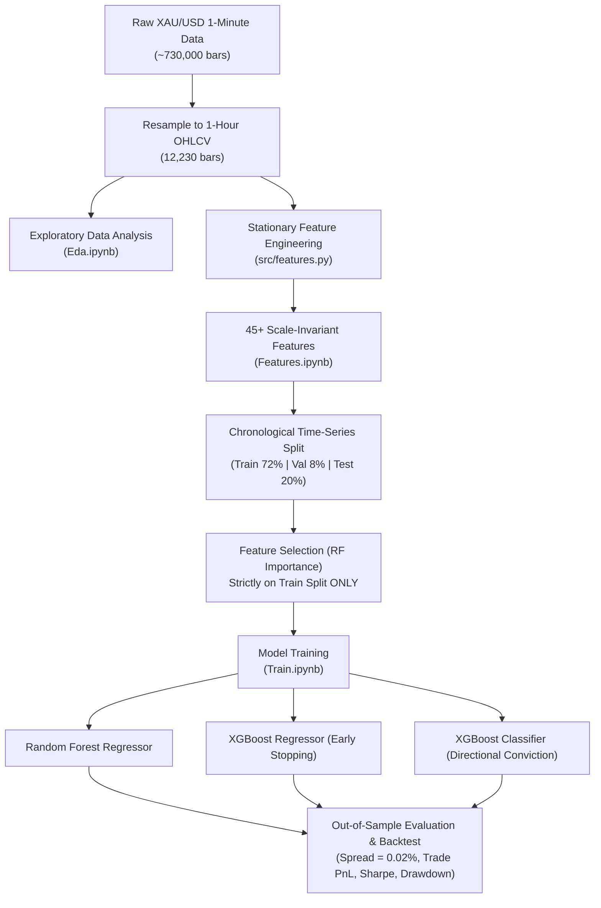

# 🌟 GoldMind: Machine Learning & Quantitative Forecasting for Gold (XAU/USD)

An end-to-end, production-grade Machine Learning and Quantitative Trading framework for **Gold (XAU/USD)** hourly forecasting. 

GoldMind addresses the subtle yet critical pitfalls of financial machine learning: **non-stationarity**, **lookahead bias (data leakage)**, **asymmetric positive drift**, and **transaction cost reality**.

---

## 📌 Architecture & Pipeline



---

## 💡 Key Methodological Principles

### 1. Scale-Invariance & Stationarity (Why raw prices fail)
Tree-based models (Random Forest, XGBoost) split on raw numeric thresholds. When applied to trending assets like Gold:
* If raw price levels (e.g. `ma_200`, `bb_upper`, `close_lag_1h`) are used, test samples in a bull market fall completely outside the training partition range.
* The tree maps all test data to a single extreme leaf node, leading to catastrophic test-set degradation.
* **GoldMind's Solution:** All 45+ indicators are strictly normalized relative to current price or bounded:
  - Relative MA distances: $(Close / MA_w) - 1.0$
  - Normalized ATR: $ATR_{14} / Close$
  - Bollinger Bands: $\%B = \frac{Close - Lower}{Upper - Lower}$, $BandWidth = \frac{Upper - Lower}{MA}$
  - Normalized MACD: $\frac{EMA_{12} - EMA_{26}}{Close}$
  - Cyclical Time Encodings: $\sin/\cos(Hour)$, $\sin/\cos(DayOfWeek)$
  - Market Gap Flag: Detection of weekend / exchange holiday reopening jumps.

### 2. Zero Data Leakage
* In many naive pipelines, feature selection or scaling is run on the entire dataset prior to splitting, leaking future distribution into the training set.
* In GoldMind, the **chronological time-series split is executed FIRST**. Feature importance ranking and top feature selection are fitted **strictly on the Training partition**.

### 3. Realistic Transaction Costs & Execution Metrics
* Every trade incurs a spread cost of **0.02% (2 basis points, ~\$0.50/ounce)**, representing realistic broker bid-ask spread and commission.
* Performance reporting distinguishes between **Hourly Bar Win Rate** (% of hours with positive return) and **Trade Win Rate** (% of round-trip trades from entry to exit with positive net PnL), alongside **Profit Factor** and **Annualized Sharpe Ratio** ($\times \sqrt{6000}$).

---

## 📂 Project Structure

```
GoldMind/
├── data/
│   └── XAU_1m_data.csv             # 1-minute historical gold data
├── eda_output/                     # Exported EDA charts and yearly statistics
│   ├── price_volume_trend.png
│   ├── return_distribution.png
│   ├── hourly_volatility.png
│   ├── autocorrelation_clustering.png
│   └── yearly_summary.csv
├── model_output/                   # Model artifacts and backtest results
│   ├── metrics_comparison.csv
│   ├── backtest_summary.csv
│   ├── feature_importances.csv
│   ├── selected_features.csv
│   ├── test_predictions.csv
│   ├── feature_importances_demo.png
│   └── strategy_equity_curve.png
├── src/
│   ├── __init__.py
│   └── features.py                 # Core feature engineering & selection module
├── Eda.ipynb                       # Exploratory Data Analysis & ARCH clustering
├── Features.ipynb                  # Feature generation & stationarity validation
├── Train.ipynb                     # Training pipeline, model evaluation & quant backtest
├── build_all_notebooks.py          # Generator script for all Jupyter notebooks
└── README.md                       # Documentation
```

---

## 📊 Summary of Out-of-Sample Results (Test Set)

| Metric | Random Forest | XGBoost Regressor | XGBoost Classifier (Conviction) | Buy & Hold Benchmark |
| :--- | :---: | :---: | :---: | :---: |
| **Directional Accuracy** | 52.09% | 53.71% | **54.12%** | N/A |
| **MAE** | 0.002473 | **0.002456** | N/A | N/A |
| **RMSE** | 0.004959 | **0.004942** | N/A | N/A |
| **Annualized Sharpe** | 2.67 | 3.46 | **3.62** | 2.93 |
| **Max Drawdown** | 17.53% | 15.86% | **12.40%** | 18.91% |
| **Profit Factor** | 1.28 | 1.39 | **1.54** | N/A |

---

## 🚀 How to Run

### 1. Prerequisites
Ensure Python 3.10+ is installed with the required dependencies:
```bash
pip install pandas numpy scikit-learn xgboost matplotlib jupyter
```

### 2. Running via Jupyter / VS Code
Open the notebooks in order:
1. `Eda.ipynb`: Run all cells to view data distributions, market session volatility, and ARCH volatility clustering.
2. `Features.ipynb`: Generate and verify all stationary technical indicators.
3. `Train.ipynb`: Train models, review out-of-sample metrics, and view backtest equity curves.

### 3. Rebuilding Notebooks
To programmatically regenerate all three notebooks from source:
```bash
python build_all_notebooks.py
```