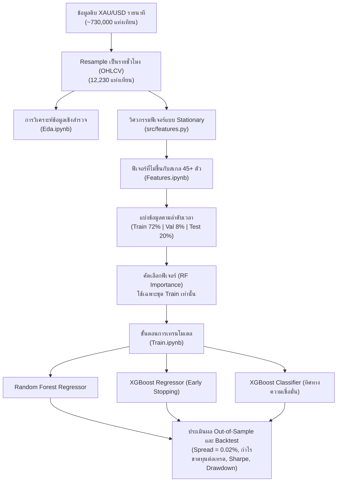

# 🌟 GoldMind: กรอบงาน Machine Learning และการพยากรณ์เชิงปริมาณสำหรับทองคำ (XAU/USD)

**GoldMind** คือกรอบงาน Machine Learning และ Quantitative Trading ระดับ production ที่ครบวงจร สำหรับการพยากรณ์ราคา **ทองคำ (XAU/USD)** แบบรายชั่วโมง (Hourly Forecasting)

โปรเจกต์นี้ถูกออกแบบมาเพื่อแก้ปัญหาที่ละเอียดอ่อนแต่สำคัญยิ่งในงาน Machine Learning ด้านการเงิน ได้แก่:
- **Non-stationarity** — ข้อมูลที่มีการเปลี่ยนแปลงคุณสมบัติทางสถิติไปตามเวลา
- **Lookahead Bias (Data Leakage)** — การรั่วไหลของข้อมูลอนาคตเข้าสู่กระบวนการเทรน
- **Asymmetric Positive Drift** — แนวโน้มขาขึ้นที่ไม่สมมาตรของสินทรัพย์
- **Transaction Cost Reality** — ต้นทุนการซื้อขายจริงที่มักถูกมองข้ามในงานวิจัย

---

## 📌 สถาปัตยกรรมและขั้นตอนการทำงาน (Architecture & Pipeline)



---

## 💡 หลักการเชิงระเบียบวิธีที่สำคัญ

### 1. ความไม่ขึ้นกับสเกล และ Stationarity (ทำไมราคาดิบถึงใช้ไม่ได้ผล)
โมเดลตระกูล Tree-based (Random Forest, XGBoost) แบ่งข้อมูลโดยใช้ค่าตัวเลขดิบเป็นเกณฑ์ (threshold) เมื่อนำไปใช้กับสินทรัพย์ที่มีแนวโน้ม (trending) อย่างทองคำ จะเกิดปัญหาดังนี้:

* หากใช้ระดับราคาดิบ (เช่น `ma_200`, `bb_upper`, `close_lag_1h`) ข้อมูลชุดทดสอบในช่วงตลาดกระทิงจะตกอยู่นอกช่วงของชุดข้อมูลฝึกฝนโดยสิ้นเชิง
* ต้นไม้ตัดสินใจจะจับคู่ข้อมูลทดสอบทั้งหมดไปยังโหนดปลาย (leaf node) สุดขั้วเพียงโหนดเดียว ส่งผลให้ประสิทธิภาพบนชุดทดสอบตกต่ำอย่างรุนแรง

**แนวทางแก้ไขของ GoldMind:** ฟีเจอร์ทั้ง 45+ ตัวถูกทำให้เป็นค่ามาตรฐาน (normalize) โดยอ้างอิงกับราคาปัจจุบันหรือถูกจำกัดขอบเขต (bounded) ดังนี้:
  - ระยะห่างสัมพัทธ์จากเส้นค่าเฉลี่ยเคลื่อนที่: $(Close / MA_w) - 1.0$
  - ATR แบบ Normalized: $ATR_{14} / Close$
  - Bollinger Bands: $\%B = \frac{Close - Lower}{Upper - Lower}$, $BandWidth = \frac{Upper - Lower}{MA}$
  - MACD แบบ Normalized: $\frac{EMA_{12} - EMA_{26}}{Close}$
  - การเข้ารหัสเวลาแบบวัฏจักร (Cyclical Time Encoding): $\sin/\cos(ชั่วโมง)$, $\sin/\cos(วันในสัปดาห์)$
  - Market Gap Flag: ตรวจจับการกระโดดของราคาช่วงเปิดตลาดหลังวันหยุดสุดสัปดาห์ / วันหยุดตลาด

### 2. ป้องกันการรั่วไหลของข้อมูล (Zero Data Leakage)
* ในไปป์ไลน์ทั่วไปที่ออกแบบไม่รัดกุม การคัดเลือกฟีเจอร์หรือการปรับสเกลข้อมูลมักถูกทำกับข้อมูลทั้งชุดก่อนแบ่งเทรน/เทสต์ ทำให้การกระจายตัวของข้อมูลในอนาคตรั่วไหลเข้าสู่ชุดฝึกฝน
* ใน GoldMind การแบ่งข้อมูลตามลำดับเวลา (Chronological Split) จะถูกทำ**ก่อนเป็นอันดับแรก** การจัดอันดับความสำคัญของฟีเจอร์และการคัดเลือกฟีเจอร์ที่สำคัญที่สุดจะ fit บน**ชุด Training เท่านั้น**อย่างเคร่งครัด

### 3. ต้นทุนการซื้อขายและตัวชี้วัดการดำเนินการที่สมจริง
* ทุกการเทรดมีต้นทุน Spread **0.02% (2 basis points หรือประมาณ 0.50 ดอลลาร์/ออนซ์)** ซึ่งสะท้อนสเปรดของโบรกเกอร์และค่าคอมมิชชันตามความเป็นจริง
* รายงานผลลัพธ์แยกความแตกต่างระหว่าง **Hourly Bar Win Rate** (% ของชั่วโมงที่ให้ผลตอบแทนเป็นบวก) และ **Trade Win Rate** (% ของการเทรดแบบ round-trip ตั้งแต่เข้าจนออกที่มีกำไรสุทธิเป็นบวก) พร้อมด้วย **Profit Factor** และ **Annualized Sharpe Ratio** ($\times \sqrt{6000}$)

---

## 📂 โครงสร้างโปรเจกต์

```
GoldMind/
├── data/
│   └── XAU_1m_data.csv             # ข้อมูลราคาทองคำย้อนหลังรายนาที
├── eda_output/                     # กราฟและสถิติรายปีจากการวิเคราะห์ข้อมูล
│   ├── price_volume_trend.png
│   ├── return_distribution.png
│   ├── hourly_volatility.png
│   ├── autocorrelation_clustering.png
│   └── yearly_summary.csv
├── model_output/                   # ผลลัพธ์โมเดลและการ backtest
│   ├── metrics_comparison.csv
│   ├── backtest_summary.csv
│   ├── feature_importances.csv
│   ├── selected_features.csv
│   ├── test_predictions.csv
│   ├── feature_importances_demo.png
│   └── strategy_equity_curve.png
├── src/
│   ├── __init__.py
│   └── features.py                 # โมดูลหลักสำหรับวิศวกรรมและคัดเลือกฟีเจอร์
├── Eda.ipynb                       # การวิเคราะห์ข้อมูลเชิงสำรวจและ ARCH clustering
├── Features.ipynb                  # การสร้างฟีเจอร์และตรวจสอบ stationarity
├── Train.ipynb                     # ไปป์ไลน์การเทรน, ประเมินผล และ backtest เชิงปริมาณ
├── build_all_notebooks.py          # สคริปต์สร้างไฟล์ Jupyter Notebook ทั้งหมด
├── requirements.txt                # รายการไลบรารีที่จำเป็นทั้งหมด
└── README.md                       # เอกสารประกอบโปรเจกต์
```

---

## 📊 สรุปผลลัพธ์ Out-of-Sample (ชุดทดสอบ)

| ตัวชี้วัด | Random Forest | XGBoost Regressor | XGBoost Classifier (Conviction) | Buy & Hold (เกณฑ์เทียบ) |
| :--- | :---: | :---: | :---: | :---: |
| **ความแม่นยำเชิงทิศทาง** | 52.54% | **54.09%** | **54.28%** | N/A |
| **MAE** | 0.002475 | **0.002455** | N/A | N/A |
| **RMSE** | 0.004958 | **0.004939** | N/A | N/A |
| **R² Score** | -0.00760 | **+0.00032** | N/A | N/A |
| **ผลตอบแทนสุทธิรวม** | 45.62% | **118.74%** | 6.57% | 52.27% |
| **Annualized Sharpe** | 2.64 | **5.32** | 0.63 | 2.93 |
| **Max Drawdown** | 13.83% | **8.62%** | 12.87% | 18.91% |
| **Trade Win Rate** | 55.30% | 54.51% | **58.79%** | N/A |
| **Profit Factor** | 1.52 | **2.24** | 1.19 | N/A |

> 📝 **หมายเหตุ:** ตัวเลขทั้งหมดคำนวณจากชุดข้อมูลทดสอบ (Test Set) ที่แบ่งแยกตามลำดับเวลาอย่างเคร่งครัด (ไม่มีการ shuffle) เพื่อจำลองสภาวะการเทรดจริงให้ใกล้เคียงที่สุด

---

## 🚀 วิธีการใช้งาน

### 1. ข้อกำหนดเบื้องต้น (Prerequisites)
ตรวจสอบให้แน่ใจว่าติดตั้ง Python 3.10 ขึ้นไป พร้อมไลบรารีที่จำเป็น:
```bash
pip install pandas numpy scikit-learn xgboost matplotlib jupyter
```

หรือติดตั้งจากไฟล์ `requirements.txt` โดยตรง:
```bash
pip install -r requirements.txt
```

### 2. การรันผ่าน Jupyter / VS Code
เปิดและรันโน้ตบุ๊กตามลำดับดังนี้:
1. **`Eda.ipynb`** — รันทุกเซลล์เพื่อดูการกระจายตัวของข้อมูล ความผันผวนตามช่วงเวลาตลาด และการรวมกลุ่มความผันผวนแบบ ARCH
2. **`Features.ipynb`** — สร้างและตรวจสอบความถูกต้องของตัวชี้วัดทางเทคนิคแบบ stationary ทั้งหมด
3. **`Train.ipynb`** — เทรนโมเดล ตรวจสอบตัวชี้วัด out-of-sample และดูกราฟ equity curve จากการ backtest

### 3. การสร้างโน้ตบุ๊กใหม่ทั้งหมด
หากต้องการสร้างโน้ตบุ๊กทั้งสามไฟล์ใหม่จากซอร์สโค้ดโดยอัตโนมัติ:
```bash
python build_all_notebooks.py
```

---

## 🧭 แนวทางการพัฒนาต่อ (Roadmap)

- [ ] เพิ่มโมเดลตระกูล Deep Learning (LSTM / Temporal Fusion Transformer) เพื่อเปรียบเทียบกับโมเดล tree-based
- [ ] รองรับการเทรนและอนุมานผลแบบ walk-forward (Rolling Window Retraining)
- [ ] เพิ่มระบบ Hyperparameter Optimization อัตโนมัติ (Optuna)
- [ ] จัดทำ Dashboard แบบ interactive สำหรับติดตามผล backtest แบบเรียลไทม์
- [ ] ขยายไปยังคู่สินทรัพย์อื่น (เช่น Silver, Oil) เพื่อทดสอบความสามารถในการนำไปใช้ทั่วไปของฟีเจอร์

---

## ⚠️ ข้อจำกัดความรับผิดชอบ (Disclaimer)

โปรเจกต์นี้จัดทำขึ้นเพื่อ**วัตถุประสงค์ด้านการศึกษาและการวิจัยเท่านั้น** ผลลัพธ์ที่แสดงในรายงาน (backtest) เป็นผลลัพธ์ในอดีต (historical) และ**ไม่ได้เป็นการรับประกันผลตอบแทนในอนาคต** การซื้อขายทองคำและตราสารทางการเงินอื่น ๆ มีความเสี่ยงสูงและอาจทำให้สูญเสียเงินลงทุนทั้งหมด ผู้ใช้งานควรศึกษาข้อมูลเพิ่มเติมและปรึกษาผู้เชี่ยวชาญทางการเงินก่อนตัดสินใจลงทุนจริง
